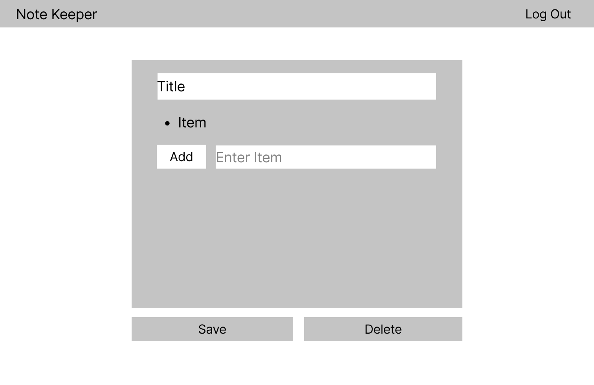

The content below is an example project proposal / requirements document. Replace the text below the lines marked "__TODO__" with details specific to your project. Remove the "TODO" lines.

(__TODO__: your project name_)

# Note Keeper

## Overview

(__TODO__: a brief one or two paragraph, high-level description of your project_)

Have lots of ideas and things to do but can't find a simple solution to organize them? Have all the options that you've tried so far been either only well suited for only task control/notetaking or neither? Want to find an easy and clean solution?

Note Keeper is a web app that allows users to organize their thoughts and tasks into list and notes. Users will login and create lists and notes that can be tagged and be customized. For more orginization, list items can link to notes and vice versa. 


## Data Model

(__TODO__: a description of your application's data and their relationships to each other_) 

The application will store Users, Lists and Items

* users can have multiple lists, folders and notes(via references)
* each list can have multiple items (by embedding)
* each folder can have multiple notes (by references)

(__TODO__: sample documents_)

An Example User:

```javascript
{
  user: "schoi",
  token: // a password token for this specific user,
  lists: // an array of references to List documents,
  folders: // array of references to Folder documents,
  notes: // array of references to Note documents
}
```

An Example List with Embedded Items:

```javascript
{
  user: // a reference to a User object
  title: "Tasks for AIT",
  font: //name of class that sets the font of choices,
  color: "pink",
  items: [
    { num: 1, text: "Quiz 7", checked: false, linked:false, link: null},
    { num: 2, text: "hw 5", checked: true, linked:true, link: //Note Reference},
  ]
}
```

An Example Note:

```javascript
{
  user: // a reference to a User object
  id: //unique number for each note
  title: "Notes on Mongo",
  font: //name of class that sets the font of choices,
  color: "pink",
  text: "- Wow some notes and stuff
  - about some stuff
  - on the hw"
  linked: true
  link: Tasks for AIT
  folder: //reference for Folder
}
```

An Example Folder:

```javascript
{
  user: // a reference to a User object
  name: "Notes for hw",
  color: "pink",
  notes: // Array of references to Note documents
}
```


## [Link to Commented First Draft Schema](db.js) 

(__TODO__: create a first draft of your Schemas in db.js and link to it_)

## Wireframes

(__TODO__: wireframes for all of the pages on your site; they can be as simple as photos of drawings or you can use a tool like Balsamiq, Omnigraffle, etc._)

/list/create - page for creating a new shopping list


/list - page for showing all shopping lists



/list/slug - page for showing specific shopping list


## Site map

(__TODO__: draw out a site map that shows how pages are related to each other_)

Here's a [complex example from wikipedia](https://upload.wikimedia.org/wikipedia/commons/2/20/Sitemap_google.jpg), but you can create one without the screenshots, drop shadows, etc. ... just names of pages and where they flow to.

## User Stories or Use Cases

(__TODO__: write out how your application will be used through [user stories](http://en.wikipedia.org/wiki/User_story#Format) and / or [use cases](https://www.mongodb.com/download-center?jmp=docs&_ga=1.47552679.1838903181.1489282706#previous)_)

1. as non-registered user, I can register a new account with the site
2. as a user, I can log in to the site
3. as a user, I can create a new grocery list
4. as a user, I can view all of the grocery lists I've created in a single list
5. as a user, I can add items to an existing grocery list
6. as a user, I can cross off items in an existing grocery list

## Research Topics

(__TODO__: the research topics that you're planning on working on along with their point values... and the total points of research topics listed_)

* (5 points) Integrate user authentication
    * I'm going to be using passport for user authentication
    * And account has been made for testing; I'll email you the password
    * see <code>cs.nyu.edu/~jversoza/ait-final/register</code> for register page
    * see <code>cs.nyu.edu/~jversoza/ait-final/login</code> for login page
* (4 points) Perform client side form validation using a JavaScript library
    * see <code>cs.nyu.edu/~jversoza/ait-final/my-form</code>
    * if you put in a number that's greater than 5, an error message will appear in the dom
* (5 points) vue.js
    * used vue.js as the frontend framework; it's a challenging library to learn, so I've assigned it 5 points

10 points total out of 8 required points (___TODO__: addtional points will __not__ count for extra credit_)


## [Link to Initial Main Project File](app.js) 

(__TODO__: create a skeleton Express application with a package.json, app.js, views folder, etc. ... and link to your initial app.js_)

## Annotations / References Used

(__TODO__: list any tutorials/references/etc. that you've based your code off of_)

1. [passport.js authentication docs](http://passportjs.org/docs) - (add link to source code that was based on this)
2. [tutorial on vue.js](https://vuejs.org/v2/guide/) - (add link to source code that was based on this)

