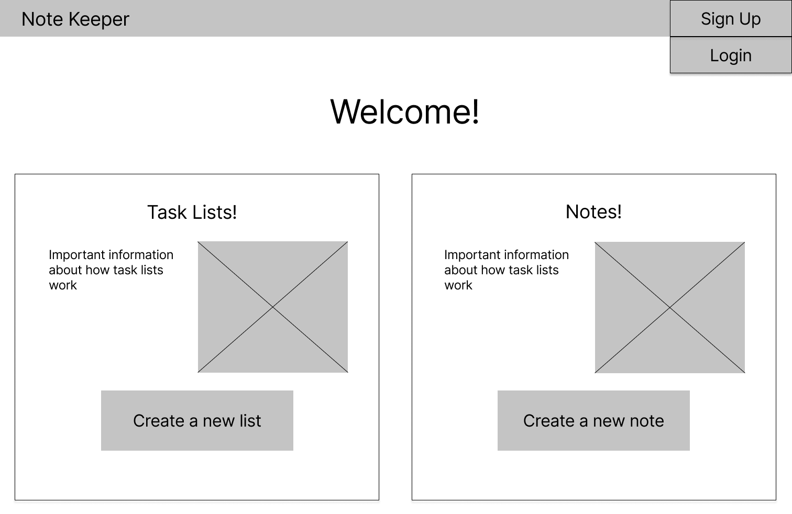
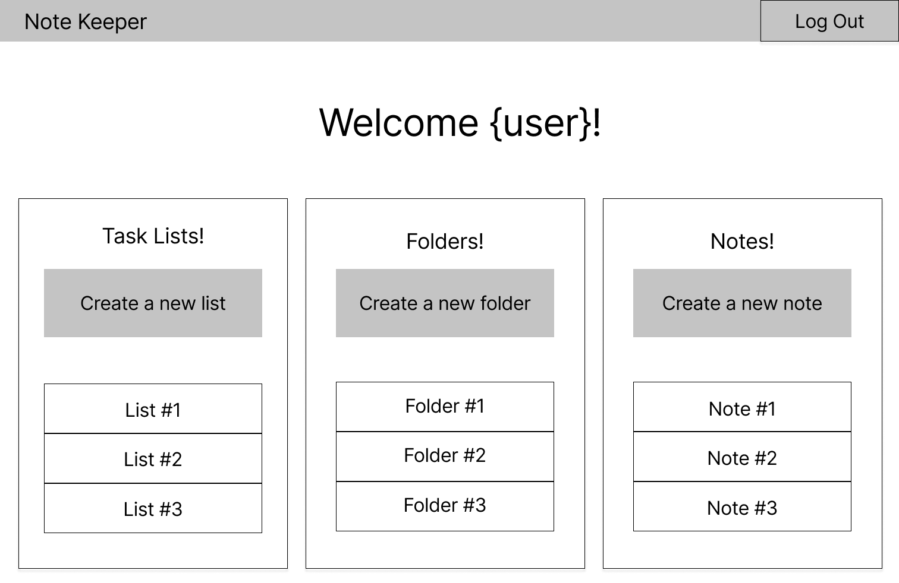
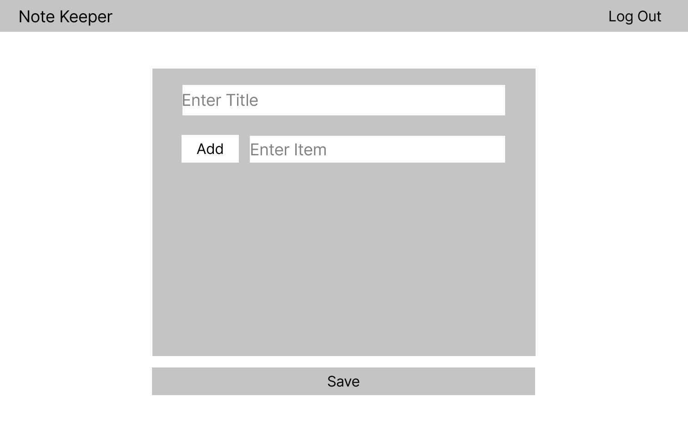
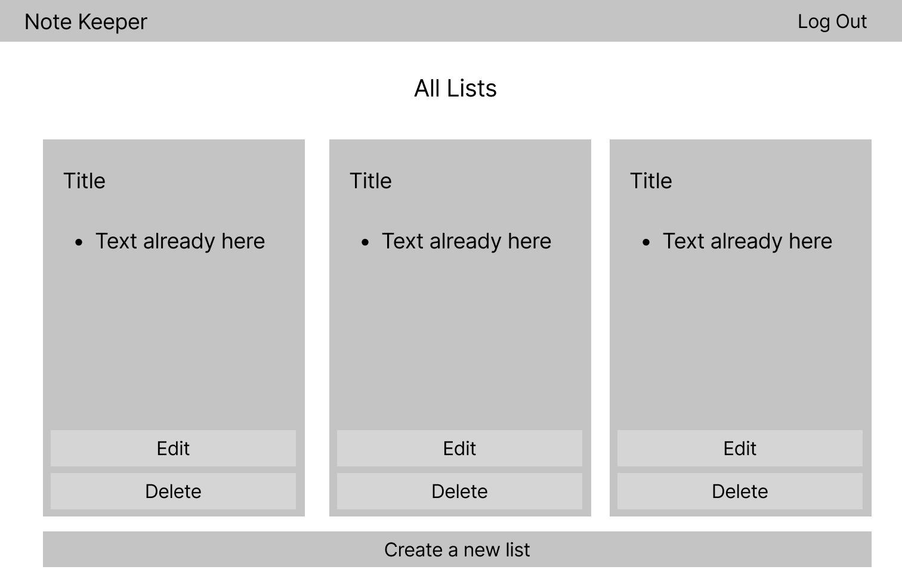
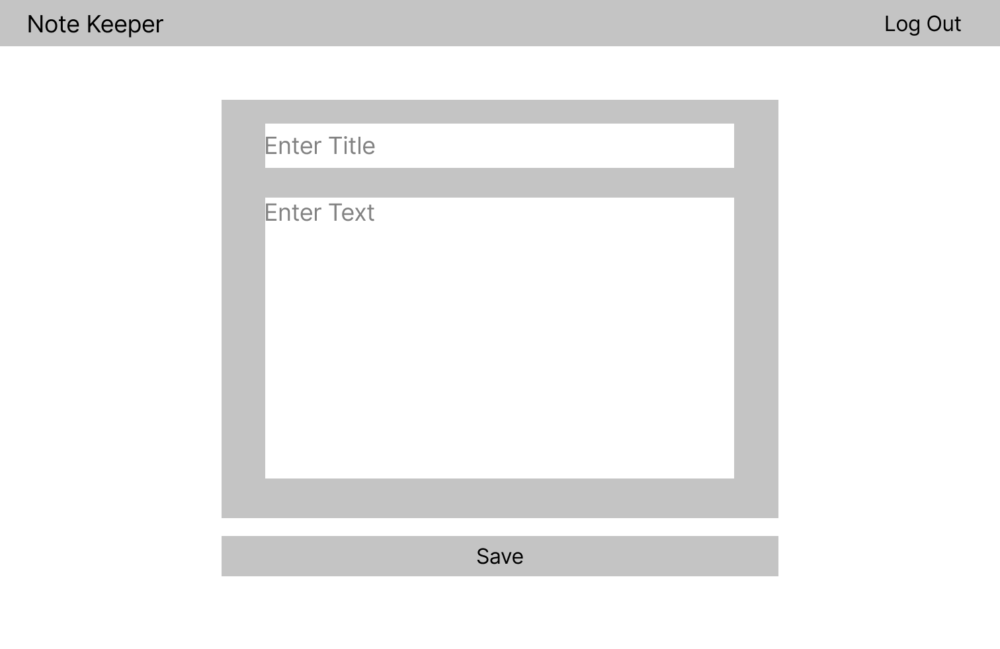
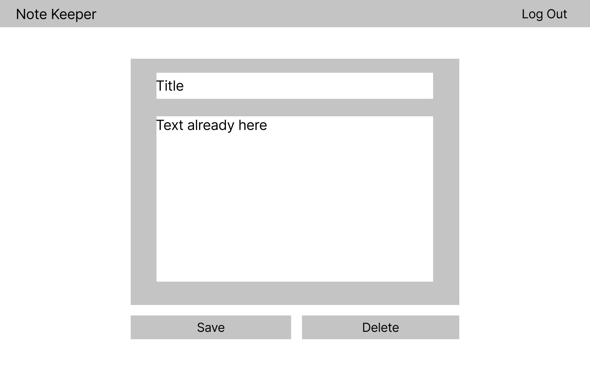
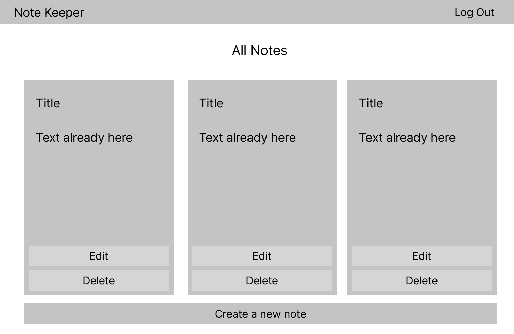
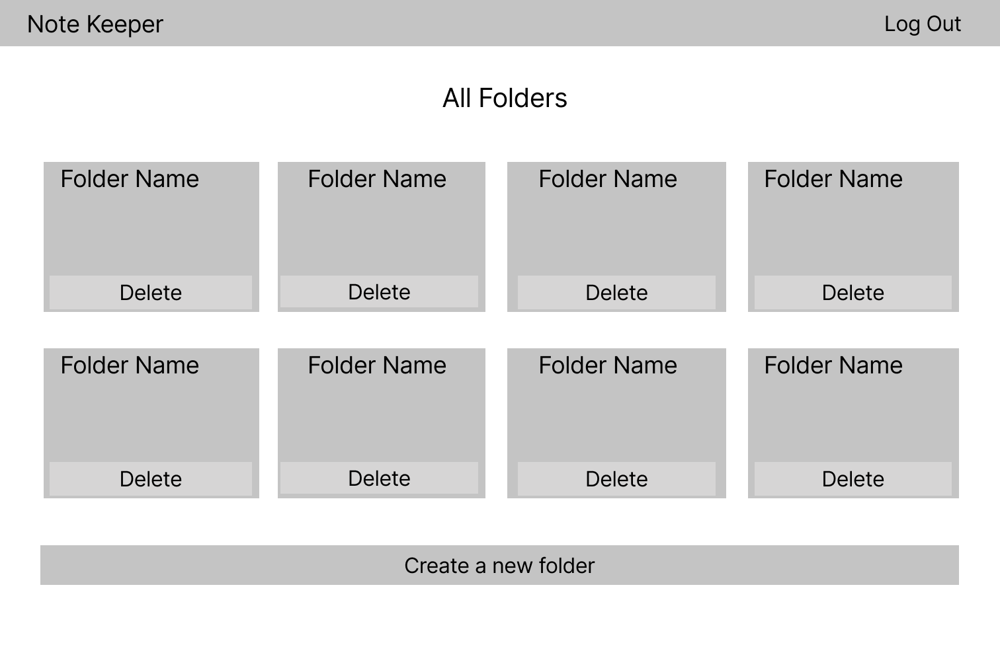
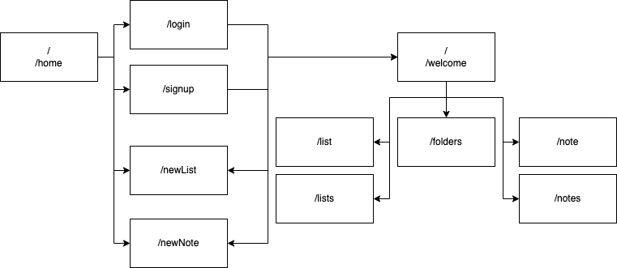
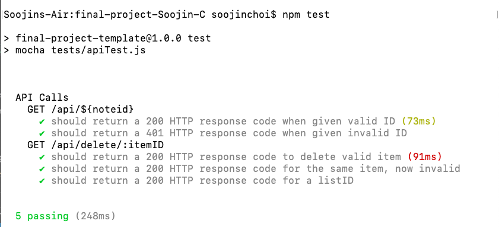

# Note Keeper

## Overview

Have lots of ideas and things to do but can't find a simple solution to organize them? Have all the options that you've tried so far been either only well suited for only task control/notetaking or neither? Want to find an easy and clean solution?

Note Keeper is a web app that allows users to organize their thoughts and tasks into list and notes. Users will login and create lists and notes that can be tagged and be customized. For more orginization, list items can link to notes and vice versa. 


## Data Model

The application will store Users, Lists, Folders, Items, Notes, NoteFolders

* users can have multiple lists, folders and notes(via references)
* each list can have multiple items (by references)
* each folder can have multiple notes (by reference of the NoteFolders table)
* exh note can be in multiple folders (by reference of the NoteFolders table)

An Example User:

```javascript
{
  user: "schoi",
  token: // a password hash for this specific user
}
```

An Example List:

```javascript
{
  user: // a reference to a User object
  title: "Tasks for AIT",
  font: "f-<fontname>",
  color: "c-pink"
}
```

An Example Item:

```javascript
{
  list: // a reference to a List object
  text: "essay on the internet",
  linked: true,
  link: //a reference to a Note that is linked
}
```

An Example Note:

```javascript
{
  user: // a reference to a User object
  title: "Notes on Mongo",
  font: //name of class that sets the font of choices,
  color: "c-pink",
  text: "- Wow some notes and stuff
  - about some stuff
  - on the hw"
}
```

An Example Folder:

```javascript
{
  user: // a reference to a User object
  name: "Notes for hw",
  color: "pink",
}
```

An Example NoteFolder:

```javascript
{
  user: // a reference to a User object
  noteid: // a reference to a Note object
  folderid: // a reference to a Folder object
}
```

## [Link to Commented First Draft Schema](db.js) 

## Wireframes

/home - page for non signed in users


/welcome - page for signed in users


/newList - page for creating a new list


/list - page for editing a already made list


/lists - page for viewing all lists made


/newNote - page for creating a new note


/note - page for editing a already made note


/notes - page for viewing all notes made


/folders - page for viewing all folders


## Site map



## User Stories or Use Cases

1. as non-registered user, I can register a new account with the site
2. as non-registered user, I can create a new note and list but cannot save
3. as a user, I can log in to the site
4. as a user, I can create a new task list
5. as a user, I can create a new note
6. as a user, I can create a new folder
7. as a user, I can view all of the task lists I've created
8. as a user, I can view all of the folders I've created
9. as a user, I can view all of the notes lists I've created
10. as a user, I can add items to a task list
11. as a user, I can remove items off a task list
12. as a user, I can edit a note
13. as a user, I can delete a note
14. as a user, I can custimize all the three: folders, notes, task lists

## Research Topics

* (3 points) Integrate user authentication
    * I'm going to be using passport and JSON web tokens for user authentication and password decoding
* (3 points) Perform Unit Tests with Mocha
    * Perform both client and server side unit testing
    
* (2 points) Bootstrap
    * used Bootstrap as the frontend framework

8 points total out of 8 required points 


## [Link to Initial Main Project File](app.js) 

## Annotations / References Used
* [Fonts from Google Fonts](https://developers.google.com/fonts/docs/getting_started)
* Icons from Bootstrap Icons

